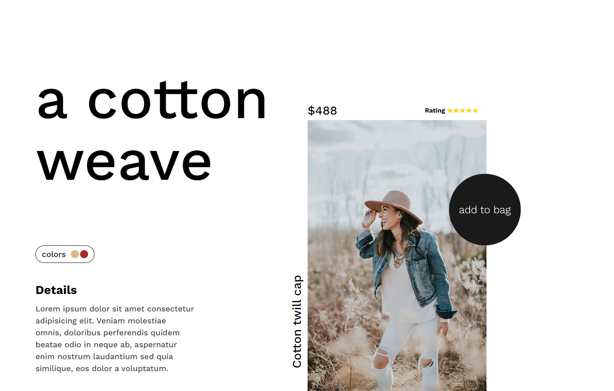
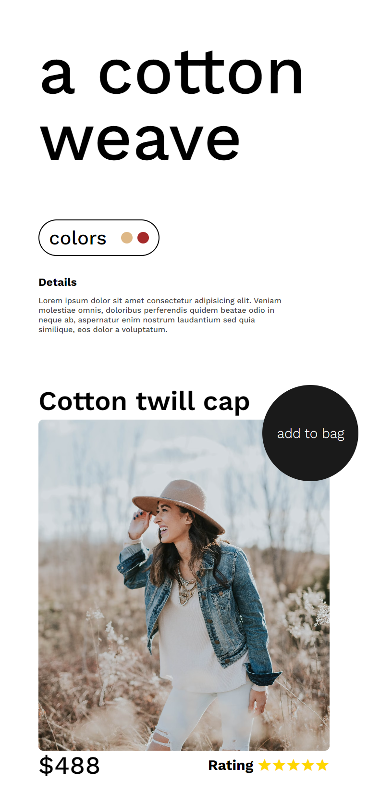

<h1>Practice-Projects2</h1>
Just Some Practice Projects using HTML and CSS

(This project is for practice)

<h2>Desktop/Laptop View:</h2>

<h2>Mobile View:</h2>

This project is a website design built using HTML, CSS, and JavaScript. The website is now fully responsive, ensuring an optimal user experience across various devices, including desktops, laptops, and mobile phones.